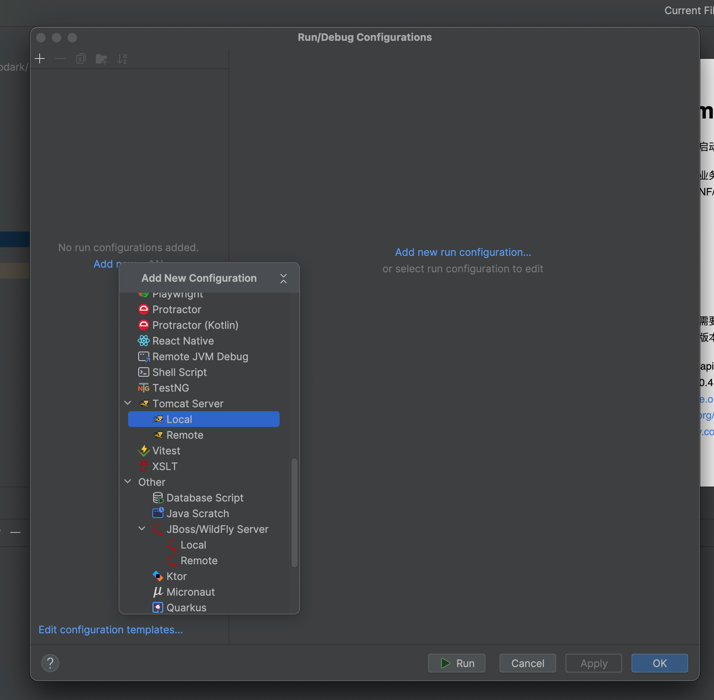
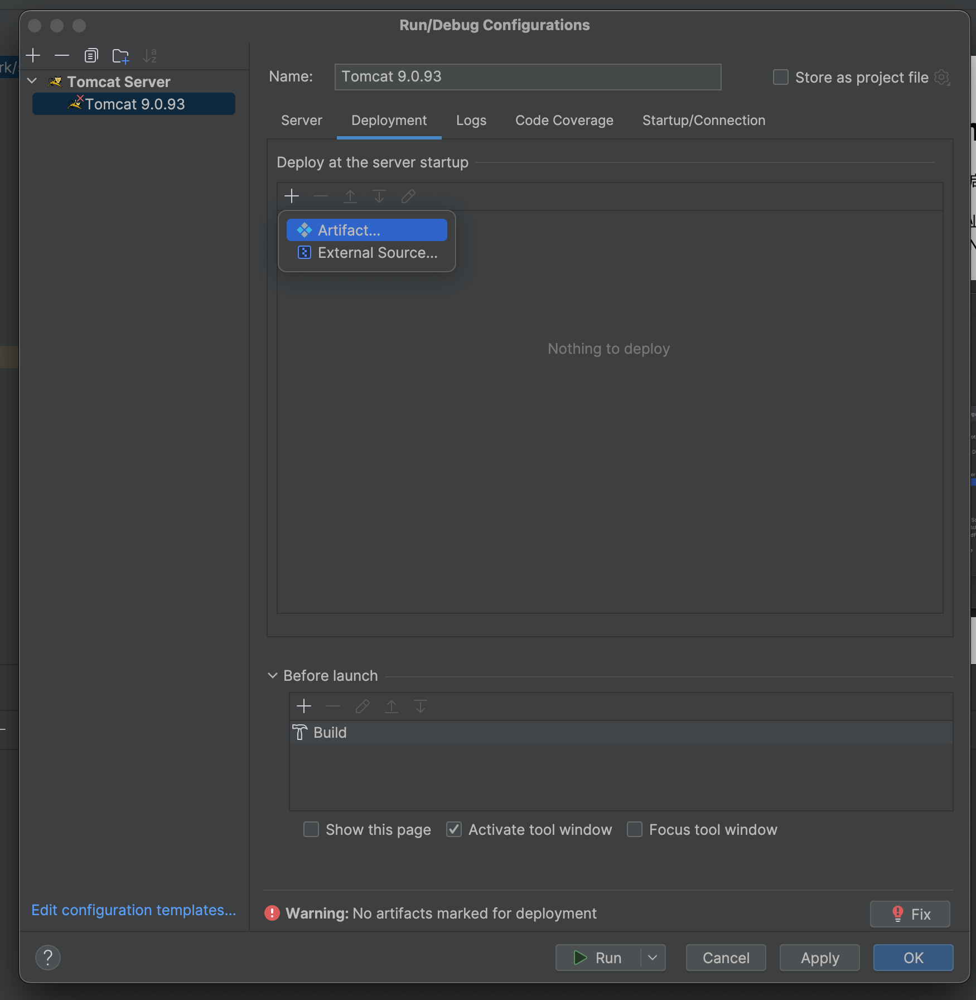
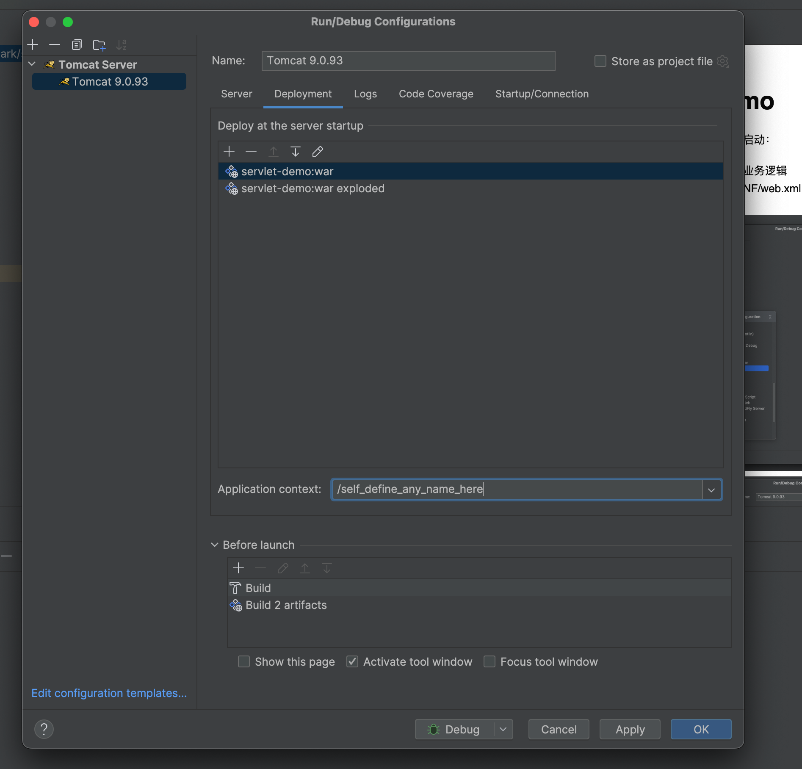
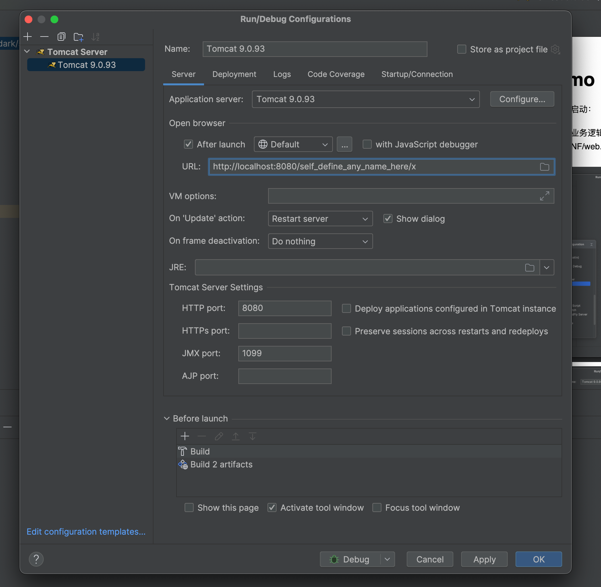

# Servlet demo

实验一下servlet项目怎么启动：

1. 继承HttpServlet实现业务逻辑
2. 配置 webapp/WEB-INF/web.xml
3. idea配置tomcat
   1. 
   2. 
   3. 
   4. 

## 问题1

tomcat版本和servlet版本需要兼容，我测试的时候用的tomcat9，
所以servlet需要是这两个版本之一：
- javax.servlet:servlet-api （猜测每种版本都可以？？）
- jakarta.servlet-api:4.0.4 (版本升级到5后就有问题了)

参考：
- https://tomcat.apache.org/whichversion.html
- https://en.wikipedia.org/wiki/Jakarta_Servlet
- https://mvnrepository.com/artifact/jakarta.servlet/jakarta.servlet-api
